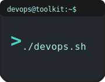

# DevOps Toolkit

<p align="center">
  
</p>

<h1 align="center">DevOps Toolkit</h1>

<p align="center">
  <strong><em>Bridge the gap between local development and CI/CD with shared CLI and configuration</em></strong><br>
  Built by <strong>Krijn van der Burg</strong> for the DevOps community
</p>

<p align="center">
  <a href="https://github.com/KrijnvanderBurg/DevOps-Toolkit/stargazers">⭐ Star this repo</a> •
  <a href="https://github.com/KrijnvanderBurg/DevOps-Toolkit/issues">🐛 Report Issues</a> •
  <a href="https://github.com/KrijnvanderBurg/DevOps-Toolkit/discussions">💬 Join Discussions</a>
</p>

## 💡 What Makes This Different?

Many DevOps setups frustrate and fail because they treat local development and CI/CD as separate worlds. You format code locally with one tool, but the pipeline uses different configurations. You install dependencies one way in development, another in production. The result? **Misaligned local and CI/CD environments** with endless updating and debugging effort.

This toolkit solves that fundamental problem through a different architectural approach and repository structure: **perfect consistency everywhere**.

### 🎯 The Core Innovation: Shared Configuration & Script Architecture

Instead of maintaining separate configurations for local and remote environments, this repository demonstrates a **single source of truth** approach through strategically designed submodules:

- **`.devcontainer/`** — Your local development environments with zero-configuration setup
- **`.azuredevops/`** — Multi-tier CI/CD pipeline templates  
- **`.dotfiles/`** — The secret sauce: shared tool configurations AND identical CLI scripts used by BOTH

Every linter, formatter, security scanner, testing tool, and more uses **exactly the same configuration files and CLI commands** whether running locally in your DevContainer or remotely in Azure Pipelines. When you run a quality check locally and it passes, you know with confidence it will pass in CI/CD too.

> **💡 Want the complete picture?** The [DevContainer README](/.devcontainer/README.md) has 10x more detail with step-by-step examples, configuration walkthroughs, and real-world usage patterns.

### 🚀 What You'll Take Away

Beyond the 25+ pipeline templates and specialized development environments, you're getting a **promising approach** for restructuring DevOps workflows that bridges local and CI/CD environments through templating standardization. You'll understand how to:

- **Architect consistency** across all environments using shared configuration and script submodules
- **Create predictable CI/CD outcomes** through identical local-remote tool execution  
- **Scale DevOps practices** without losing quality or increasing complexity
- **Onboard teams quickly** with zero-configuration containerized environments

This isn't just another template library— it's an exploration of how modern DevOps consistency can be structured and work.

### 🎯 What You Get Immediately

✅ **20+ Pre-configured Development Tools** - Ruff, Pylint, Mypy, Bandit, Pytest, and more working perfectly together  
✅ **3 Specialized DevContainer Environments** - Python/Spark development, distributed computing, infrastructure as code  
✅ **25+ Production-Ready Pipeline Templates** - Atomic tools, composite workflows, complete CI/CD solutions  
✅ **Zero Configuration Required** - Everything works out-of-the-box in seconds, not hours  
✅ **Shared Local-Remote Consistency** - Identical tool execution bridges the gap between development and CI/CD  
✅ **Proven Patterns** - Approaches tested in real development environments

> **🚀 Ready for hands-on examples?** The [Azure DevOps Templates README](/.azuredevops/README.md) contains extensive documentation with real pipeline examples, parameter guides, and composition patterns.


## 🌟 Why This Approach Changes Your Way of Working

### Instant Environment Setup
Specialized DevContainers for Python development (20+ code quality tools) with complete Apache Spark clusters launch in moments. Every tool pre-configured, every extension ready, every quality gate in CI/CD active locally with zero effort.


> **🔍 See every detail:** The [DevContainer documentation](/.devcontainer/README.md) shows you exactly how this works—from container configuration to tool integration, with complete examples you can run yourself.

### Multi-Tier Template Patterns
Atomic templates serve as idempotent building blocks that compose into higher-level workflows like `linter.yaml`. Switch underlying tools anytime—as long as parameters match, everything continues working. Share these templates across all repositories to eliminate setup fragmentation.

25+ Azure DevOps templates representing real-world patterns: code formatting, security scanning, dependency analysis, automated testing—all battle-tested and ready to adapt.


> **⚙️ Go deeper into templates:** The [Azure DevOps Templates README](/.azuredevops/README.md) has comprehensive guides on atomic template design and composition patterns.

### Perfect Local-Remote Consistency
The shared configuration architecture means your DevContainer runs `ruff --config .dotfiles/python/ruff.toml` and your Azure Pipeline runs the exact same command with the same config file. This transforms CI/CD from an unpredictable feedback mechanism into a reliable quality gate— when local checks pass, you can be confident about remote execution.

**Ready to dive deeper?** Explore the [DevContainer documentation](/.devcontainer/README.md) and [Azure DevOps templates documentation](/.azuredevops/README.md).

> **🛠️ Master the configuration magic:** The [.dotfiles documentation](/.devcontainer/.dotfiles/README.md) reveals how shared configurations work under the hood—complete with examples and advanced patterns.


## 📚 Learn the Methodology  

Master the architectural patterns through this comprehensive blog series:

- [📈 **Automatically Generate and Visualize Python Code Coverage in VSCode**](https://medium.com/@krijnvanderburg/automatically-generate-and-visualize-python-code-coverage-308e65627925)  
    *Learn how I automated my Python code coverage in VSCode! Instantly visualize coverage data in the editor for faster, more efficient development.*

- [👮‍♂️ **How to enforce Code Quality standards using CI/CD**](https://krijnvanderburg.medium.com/enforce-code-quality-standards-using-cicd-c2b08d812550)  
    *Learn how to enforce code quality standards with CI/CD pipelines for tools like Ruff, ensuring consistency and security in your software development.*

- [🤖 **DevContainers Mastered: Automating Manual Workflows with VSCode Tasks - Part 3/3**](https://krijnvanderburg.medium.com/how-i-automate-my-entire-ide-vscode-akin-to-cicd-992568ee7fb5)  
    *Automate your local development workflows with VSCode tasks and DevContainers akin to CICD. Remove all manual forms testing, dependencies, and more!*

- [🛡️ **DevContainers Improved: Integrating Code Quality Checks for Continuous Feedback - Part 2/3**](https://krijnvanderburg.medium.com/add-code-quality-tools-in-your-ide-840df78c64d5)  
    *Improve your workflow with DevContainers! Integrate code quality checks in VSCode for real-time feedback and error-free code. Boost productivity now!*

- [👨‍💻 **DevContainers Introduction: The Ideal Standardized Team Development Environment — Part 1/3**](https://krijnvanderburg.medium.com/devcontainers-the-ideal-standardised-team-dev-environment-zero-bs-2-7eb77f0cb4ee)  
    *Discover how DevContainers streamline team workflows, ensure consistent environments, and automate setups for faster development and easier onboarding.*

- [🚀 **Distribute Tests with Pytest-Split for Faster CI/CD Execution**](https://krijnvanderburg.medium.com/how-to-distribute-tests-in-ci-cd-for-faster-execution-zero-bs-1-b86d4d69b19d)  
    *Speed up your CI/CD with pytest-split! Learn how to distribute tests across agents for faster execution in Azure Pipelines and other platforms.*

- [⚡ **Local Multi-Node Spark Cluster in a DevContainer — Plug and Play**](https://medium.com/@krijnvanderburg/local-multi-node-spark-cluster-in-a-devcontainer-35f934e51308)  
    *Learn how to set up a fully configured, multi-node Spark cluster locally using DevContainer with Docker Compose. Ready out-of-the-box for data engineering.*  

- [🔒 **Dependency Lock Files are a Risk for End Users that You’re Ignoring**](https://medium.com/@krijnvanderburg/dependency-lock-files-are-a-risk-for-end-users-4d9b35b95e54)  
    *Why dependency tools like Poetry and Pip hide real-world user issues and how building and installing your own package can uncover hidden problems.*  

## 🚀 Get Started

### Prerequisites
- [Docker Desktop](https://www.docker.com/products/docker-desktop/) and [VS Code](https://code.visualstudio.com/) with [Dev Containers extension](https://marketplace.visualstudio.com/items?itemName=ms-vscode-remote.remote-containers)
- [Azure DevOps account](https://azure.microsoft.com/en-us/products/devops/) (free with generous CI/CD minutes)

### Three Steps to Success

**1. Clone Everything**
```bash
git clone https://github.com/KrijnvanderBurg/DevOps-Toolkit.git
cd DevOps-Toolkit
git submodule update --init --recursive
```
*The `--recursive` flag pulls the nested `.dotfiles` submodule that makes everything work identically everywhere.*

**2. Launch Development Environment**
- Open VS Code → `F1` → "Dev Containers: Rebuild and Reopen in Container"  
- Choose your environment (Python development, Spark cluster, or infrastructure)
- Watch 20+ tools configure and run automatically

**3. Deploy CI/CD Pipeline**
- Create new pipeline in Azure DevOps using included `azure-pipelines.yml`
- See the exact same quality checks run remotely

### 🎯 Explore the Components

**🔥 Want the complete implementation details?** Each component has extensive documentation with examples, configuration guides, and real-world usage patterns—**10x more content** than this overview:

- **[📦 DevContainers](/.devcontainer/README.md)** — **Deep-dive documentation:** Complete setup guides, tool configurations, troubleshooting, and advanced examples
- **[🔄 Azure DevOps Templates](/.azuredevops/README.md)** — **Comprehensive pipeline library:** 25+ templates with parameter guides, composition patterns, and production deployment strategies  
- **[🗂️ .dotfiles](/.devcontainer/.dotfiles/README.md)** — **Configuration mastery:** How shared configs work and tool-specific setup guides

> **💡 Pro tip:** Start with the [DevContainer README](/.devcontainer/README.md) for hands-on examples, then explore the [Templates documentation](/.azuredevops/README.md) to see how everything connects in CI/CD.
